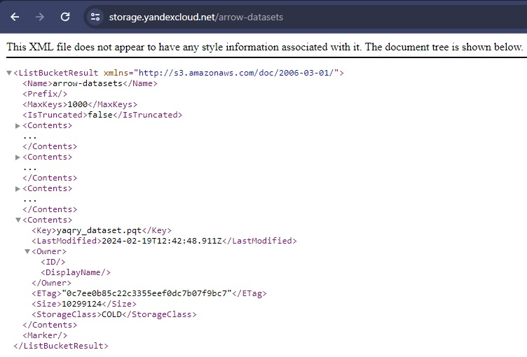
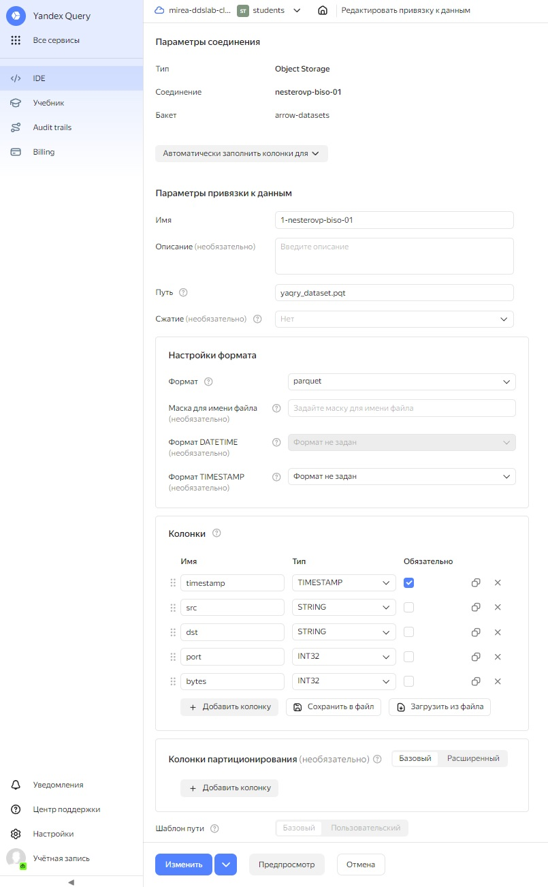
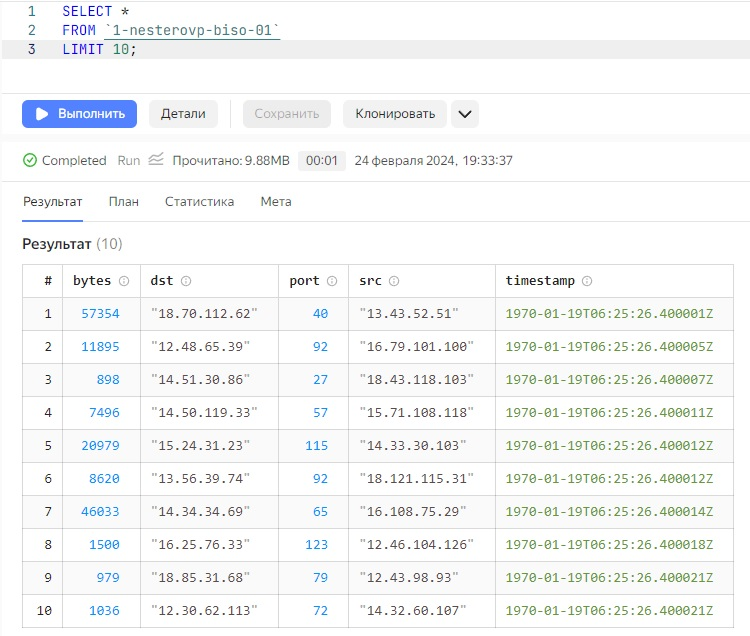
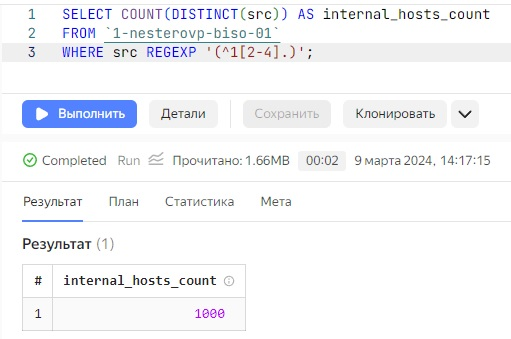
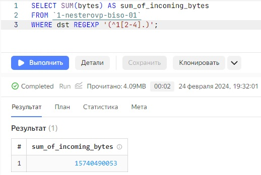

# Лабораторная работа № 1
Нестеров Павел

# Использование технологии Yandex Query для анализа данных сетевой активности

## Цель работы

1.  Изучить возможности технологии **Yandex Query** для анализа
    структурированных наборов данных
2.  Получить навыки построения аналитического пайплайна для анализа
    данных с помощью сервисов **Yandex Cloud**
3.  Закрепить практические навыки использования SQL для анализа данных
    сетевой активности в сегментированной корпоративной сети

## Исходные данные

1.  ОС Windows 11
2.  Yandex Cloud: S3 Object Storage
3.  **Yandex Query**
4.  Датасет **yaqry_dataset.pqt**

**Общая ситуация**

Вам стали доступны данные сетевой активности в корпоративной сети
компании XYZ. Данные хранятся в Yandex Object Storage. Проведите
разведочный анализ данных и ответьте на вопросы

## Задание

Используя сервис **Yandex Query** настроить доступ к данным, хранящимся
в сервисе хранения данных **Yandex Object Storage**. При помощи
соответствующих SQL запросов ответить на вопросы

## Ход работы

### Шаг 1. Проверить доступность данных в **Yandex Object Storage**

Для просмотра доступных объектов бакета в хранилище необходимо
сформировать ссылку вида `https://storage.yandexcloud.net/<bucket-name>`



Видим в списке нужный файл - **yaqry_dataset.pqt**, для скачивания
необходимо перейти по ссылке
`https://storage.yandexcloud.net/arrow-datasets/yaqry_dataset.pqt`

### Шаг 2. Подключить бакет как источник данных для **Yandex Query**

#### 1. Создадим соединение для бакета в S3 хранилище: заполняем поля с учетом допустимых символов, выбираем тип аутентификации *публичный*. Вводим имя бакета в соответствующее поле и сохраняем.


#### 2. Теперь, после создания соединения, укажем какой объект использовать в качестве источника данных. Для этого нужно сделать привязку данных.



#### 3. Посмотрим на датасет



### Шаг 3. Анализ

##### 1. Известно, что IP адреса внутренней сети начинаются с октетов, принадлежащих интервалу \[12-14\]. Определите количество хостов внутренней сети, представленных в датасете

``` {SQL}
SELECT COUNT(DISTINCT(src)) AS internal_hosts_count
FROM `1-nesterovp-biso-01`
WHERE src REGEXP '(^1[2-4].)';
```



##### 2. Определите суммарный объём исходящего трафика

``` {SQL}
SELECT SUM(bytes) AS sum_of_outcoming_bytes
FROM `1-nesterovp-biso-01`
WHERE src REGEXP '(^1[2-4].)';
```


##### 3. Определите суммарный объём входящего трафика

``` {SQL}
SELECT SUM(bytes) AS sum_of_incoming_bytes
FROM `1-nesterovp-biso-01`
WHERE dst REGEXP '(^1[2-4].)';
```



## Оценка результатов

В ходе практической работы был проведён анализ сетевой активности с
помощью языка SQL

## Вывод

Были получены начальные навыки работы с **Yandex Cloud**, а также с
сервисом **Yandex Query**
