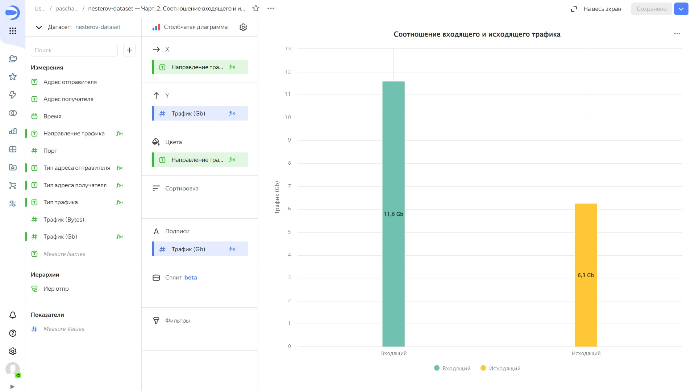

# Лабораторная работа № 2
Нестеров Павел

# Использование технологии Yandex DataLens для анализа данных сетевой активности

## Цель работы

1.  Изучить возможности технологии **Yandex DataLens** для визуального
    анализа структурированных наборов данных
2.  Получить навыки визуализации данных для последующего анализа с
    помощью сервисов **Yandex Cloud**
3.  Получить навыки создания решений мониторинга/SIEM на базе облачных
    продуктов и открытых программных решений
4.  Закрепить практические навыки использования SQL для анализа данных
    сетевой активности в сегментированной корпоративной сети

## Исходные данные

1.  ОС Windows 11
2.  Yandex Cloud: S3 Object Storage
3.  **Yandex Query**
4.  **Yandex DataLens**
5.  Датасет yaqry_dataset.pqt

**Общая ситуация**

Вы продолжаете развитие своих решений, выполненных в ходе практической
работы №1.

Для понимания сетевой обстановки и принятия решений по управлению
информационной безопасностью Вам необходимо визуально представить
результаты анализа информации, выполненной в **Yandex Query** с помощью
продукта **DataLens**. Конкретнее – serverless решение в облаке **Yandex
Cloud**.

Как и прежде, у Вас есть данные сетевой активности в корпоративной сети
компании XYZ. Данные хранятся в **Yandex Object Storage**. Вы провели
разведочный анализ данных и имеете представление о структуре данных.

Вам необходимо построить observability решение – средство визуального
представления информации для мониторинга и оценки сетевой активности.

## Задание

Используя сервис **Yandex DataLens** настроить доступ к результатам
**Yandex Query**, полученным в ходе выполнения практической работы №1, и
визуально представить результаты анализа данных

## Задачи

1.  Представить в виде круговой диаграммы соотношение внешнего и
    внутреннего сетевого трафика
2.  Представить в виде столбчатой диаграммы соотношение входящего и
    исходящего трафика из внутреннего сетевого сегмента
3.  Построить график активности (линейная диаграмма) объема трафика во
    времени
4.  Все построенные графики вывести в виде единого дашборда в **Yandex
    DataLens**

## Ход работы

### Шаг 1. Настроить подключение к **Yandex Query** из **DataLens**

Для начала необходимо перейти в сервис [Yandex
DataLens](https://datalens.yandex.ru/) и создать новое подключение. В
нашем случае нужно использовать уже существующий сервисный аккаунт
`students-datalens-query`


### Шаг 2. Создать из запроса Yandex Query датасет DataLens

Для того, чтобы создать датасет, необходимо выбрать только что созданное
подключение и перетащить датасет, который остался с прошлой практической
работы. Видим нашу таблицу сетевого трафика


### Шаг 3. Создать чарты

Для 1-го чарта, который будет отображать соотношение внешнего и
внутреннего трафика выбираем “Круговая диаграмма”. При необходимости
надо добавить дополнительные вычисляемые поля, введя для каждого из них
формулу. Вот пример одного из них:


Для отображения диаграммы нужно перетащить нужные поля в секции
`категория`, `показатели`, `сортировка`, `подписи` и т.д. и при
необходимости подкрректировать формат выводимых значений.


Для 2-го чарта необходимо задать поля, которые помогут узнать является
ли трафик входящим или исходящим. Пример формулы для распознавания
направления трафика:


Выбираем тип чарта “линейная диаграмма”, размещаем поля в нужных ячейках
и получаем диаграмму соотношения входящего и исходящего трафика из
внутреннего сетевого сегмента:



3-й чарт будет вида линейной диаграммы, отобразим изменение объёма
трафика во времени. По аналогии создадим нужные поля и перетащим их в
нужные ячейки:


График оказался не особо информативным, т.к. в датасете представлен
сетевой дамп всего за 1.5 секунды. В связи с этим сделаем дополнительный
чарт, который будет показывать изменение объёма трафика по его типу.
Создадим поле `Тип трафика` по следующей логике:

``` yql
IF [Тип адреса отправителя] = "Внешний" AND [Тип адреса получателя] = "Внутренний" 
    THEN "Входящий"
ELSEIF [Тип адреса отправителя] = "Внутренний" AND [Тип адреса получателя] = "Внешний" 
    THEN "Исходящий"
ELSE
    "Внутренний"
END
```

Воспользуемся ячейкой “Сплит”, чтобы разделить график на 3 участка,
каждый из которых будет относиться к своему виду трафика:


### Шаг 4. Составить дашборд

Теперь осталось только добавить все созданные чарты на дашборд:


#### Ссылка на дашборд: https://datalens.yandex/pt4y483d88lmd

``` r
sprintf("Done")
```

    [1] "Done"

## Оценка результатов

В ходе практической работы был проведен анализ сетевой активности с
помощью SQL

## Вывод

Были получены начальные навыки работы с **Yandex Cloud**, а также с
сервисом **Yandex DataLens**
